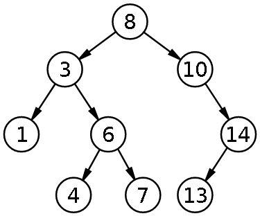

## How to solve this challenge?

1. Read the "Challenge description" below.
2. Make changes to the [challenge.rb](./challenge.rb) file.
3. Commit your changes.
4. Wait for the result of the "GitHub Classroom Workflow" action. If it is green - congratulations, you solved this challenge! If not - try again!
5. *You can watch an example of how to solve a challenge in [this video](https://microverse.pathwright.com/library/fast-track-algorithms-data-structures/69123/path/step/113963868/)*

Note: We use RSpec for checking your solution with unit tests. You can [install](https://github.com/rspec/rspec) it and use it in your local environment if you like.

## Challenge description

### Binary Search Tree
The Binary Search Tree is a a Binary Tree which stores keys in a sorted manner. Every node's key is smaller than all the key's in the node's left subtree and greater than all the key's in the nodes right subtree. Here's an example:



#### Inserting Elements in the Tree
Insertion and Search can usually be done very quickly in a binary Tree. The smallest and largest elements in the tree are easy to find. It's simple to go from one element to the next in the tree and to through the entire Tree in order.


#### Challenge
You will be given an array of numbers as input. Insert the numbers (in order) one-at-a-time into a binary search tree. Then return a string with the tree in pre-order (You can use the pre-order function that you wrote in the previous lesson).
```
binary_search_tree([8, 3, 10, 1, 6, 14, 4, 7, 13])
# => "8 3 1 6 4 7 10 14 13"
```


#### Get stuck and need some hint?

Check below link: 

*https://gitlab.com/microverse/guides/coding_challenges/hints/blob/master/challenges/tress_and_graphs/binary-search-tree.md*
