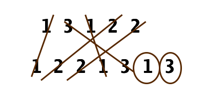

## How to solve this challenge?

1. Read the "Challenge description" below.
2. Make changes to the [challenge.rb](./challenge.rb) file.
3. Commit your changes.
4. Wait for the result of the "GitHub Classroom Workflow" action. If it is green - congratulations, you solved this challenge! If not - try again!
5. *You can watch an example of how to solve a challenge in [this video](https://microverse.pathwright.com/library/fast-track-algorithms-data-structures/69123/path/step/113963868/)*

Note: We use RSpec for checking your solution with unit tests. You can [install](https://github.com/rspec/rspec) it and use it in your local environment if you like.


## Challenge description

### Find the Duplicates

Sometimes you need to compare lists of number, but sorting each one normally will take too much time. Instead you can use alternative methods to find the differences between each list. Try to find a faster way to do this challenge than sorting two entire lists.

### Challenge

Numeros The Artist was arranging two identical lists of numbers A and B into specific orders. While it seemed like two random arrangements to everyone else, Numeros was very proud of his arrangements. Unfortunately, some numbers got left out of List A. Can you find the missing numbers from A without messing up his order?

#### Details

There are many duplicates in each list, but you need to find the extra numbers in B that remain once all the AB "matches" have been found. The numbers are all within a range of 100 from each other.



#### Guideline

Don't sort the lists to solve this problem. In fact, you can solve it with one pass through each of the lists.

#### Challenge
Find all the 'extra' numbers that are in B but not in A, and output them in ascending order.

#### Example
```
p duplicates([203, 204, 205, 206, 207, 208, 203, 204, 205, 206], [203, 204, 204, 205, 206, 207, 205, 208, 203, 206, 204, 205, 206])
# => [204, 205, 206]
```

These numbers are extra in the 2nd list. Note each list can be in any order and the extra numbers can appear anywhere in the list.
