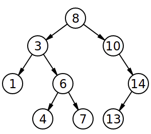
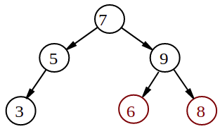

## How to solve this challenge?

1. Read the "Challenge description" below.
2. Make changes to the [challenge.rb](./challenge.rb) file.
3. Commit your changes.
4. Wait for the result of the "GitHub Classroom Workflow" action. If it is green - congratulations, you solved this challenge! If not - try again!
5. *You can watch an example of how to solve a challenge in [this video](https://microverse.pathwright.com/library/fast-track-algorithms-data-structures/69123/path/step/113963868/)*

Note: We use RSpec for checking your solution with unit tests. You can [install](https://github.com/rspec/rspec) it and use it in your local environment if you like.


## Challenge description

### Is it a Search Tree?
_Given a binary tree, can you determine if it is a proper Binary Search Tree?_

In a binary search tree, every descendant to the right of node P must be greater than P, and every descendant to the left of P must be less than P.

The input will be given as a list, as in the previous exercises.

Here's a good Binary Search Tree:



...and here's a bad one:



This tree is not a proper BST for 2 reasons:
- The 8 is smaller than the 9, even though it is in a right subtree of 9.
- The 6 is smaller than the 7, even though it is in a right subtree of 7.

### Challenge
Return true if the given tree is a proper binary search tree, and false otherwise.

### Example
```ruby
tree = [10, 4, 12]

search_tree?(tree)
# => true
```
#### Get stuck and need some hint?
Check this link: 
https://gitlab.com/microverse/guides/coding_challenges/hints/blob/master/challenges/tress_and_graphs/is-it-a-search-tree.md
