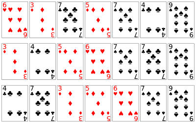

## How to solve this challenge?

1. Read the "Challenge description" below.
2. Make changes to the [challenge.rb](./challenge.rb) file.
3. Commit your changes.
4. Wait for the result of the "GitHub Classroom Workflow" action. If it is green - congratulations, you solved this challenge! If not - try again!
5. *You can watch an example of how to solve a challenge in [this video](https://microverse.pathwright.com/library/fast-track-algorithms-data-structures/69123/path/step/113963868/)*

Note: We use RSpec for checking your solution with unit tests. You can [install](https://github.com/rspec/rspec) it and use it in your local environment if you like.


## Challenge description

### Merge Sort I

Like QuickSort, MergeSort runs quickly in O(n log n) time. While Mergesort uses more space and is not usually as fast (in practice) as Quicksort, Mergesort has the benefit of being stable, which means it keeps duplicate elements in the original order that they started with. This is meaningless if the values being sorted is all there is, but usually there's associated data with each element which sometimes needs to be preserved in the original order. For example, if you sort by one value of an item, and then by another value, you may not want the second sort to mess up the order of the first sort.

#### Stable Sort Example

Sort a deck of card so the suits are in order and each suit is in number-order.

#### Answer:
0 - Start with an unsorted deck
1 - Sort the entire deck by number
2 - Use a stable sort and sort by suit. Since the sort is stable, the number order is preserved. See each step below:



#### Merge Method

The main part of MergeSort involves the merge method, which merges 2 sorted arrays to create one sorted array. This can be done in one pass through the arrays, by comparing the values of the two arrays before placing a value in the large array.

#### Challenge

You are given two sorted arrays. Can you merge the them and return one sorted array? This should be done with only one run through the array.

#### Example
```
p merge_sort([1, 3, 9, 11], [2, 4, 6, 8])
# => [1, 2, 3, 4, 6, 8, 9, 11]
```

#### Get stuck and need some hint?
Check below link: 

*https://gitlab.com/microverse/guides/coding_challenges/hints/blob/master/challenges/sorting-algorithms/merge-sort-1.md*

