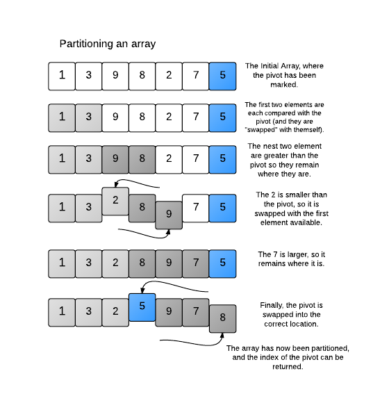

## How to solve this challenge?

1. Read the "Challenge description" below.
2. Make changes to the [challenge.rb](./challenge.rb) file.
3. Commit your changes.
4. Wait for the result of the "GitHub Classroom Workflow" action. If it is green - congratulations, you solved this challenge! If not - try again!
5. *You can watch an example of how to solve a challenge in [this video](https://microverse.pathwright.com/library/fast-track-algorithms-data-structures/69123/path/step/113963868/)*

Note: We use RSpec for checking your solution with unit tests. You can [install](https://github.com/rspec/rspec) it and use it in your local environment if you like.


## Challenge description

### Quick-Sort Advanced

The previous version of Quicksort was easy to understand, but it was not optimal. It required copying the numbers into other arrays, which takes up more space and time. To make things faster, one can create an "in-place" version of Quicksort, where the numbers are all sorted within the array itself. 

#### Challenge 

Create an in-place version of Quicksort. This time, always select the last element in the 'sub-array' as a pivot. Partition the left side and then the right side of the array. Print out the whole array at the end of every partitioning method. 

#### Guideline 

Instead of copying the array into multiple sub-arrays, use indices to keep track of the different sub-arrays. You can pass the indices to a modified partition method. The partition method should partition the sub-array and then return the index location where the pivot gets placed, so you can then call partition on each side of the pivot. 

Since you cannot just create new sub-arrays for the elements, Partition will need to use another trick to keep track of which elements are greater and which are smaller than the pivot.

#### The In-place Trick

If an element is smaller than the Pivot, you should swap it with a (larger) element on the left-side of the sub-array. Large elements can just remain where they are, and the pivot can then be inserted in the middle at the end of the partition method. To ensure that you don't swap a small element with another small element, use an index to keep track of the "small" elements.



#### Explanation of Sample I/O 
The 5 is initially selected as the pivot, and the array is partitioned as shown in the diagram. The left side is partitioned next, with the 2 as the pivot. Finally the right side is partitioned, with the 8 as the pivot. The entire array is now sorted.

#### Challenge
Create an in-place QuickSort and print the entire array on a new line at the end of every partitioning method

#### Example
```
advanced_quicksort([1, 3, 9, 8, 2, 7, 5])
# => 1 3 2 5 9 7 8
#    1 2 3 5 9 7 8
#    1 2 3 5 7 8 9
```


#### Get stuck and need some hint?

Check this link:

*https://gitlab.com/microverse/guides/coding_challenges/hints/blob/master/challenges/sorting-algorithms/quick-sort-advanced.md*
