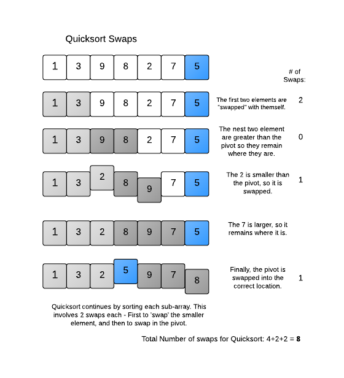

## How to solve this challenge?

1. Read the "Challenge description" below.
2. Make changes to the [challenge.rb](./challenge.rb) file.
3. Commit your changes.
4. Wait for the result of the "GitHub Classroom Workflow" action. If it is green - congratulations, you solved this challenge! If not - try again!
5. *You can watch an example of how to solve a challenge in [this video](https://microverse.pathwright.com/library/fast-track-algorithms-data-structures/69123/path/step/113963868/)*

Note: We use RSpec for checking your solution with unit tests. You can [install](https://github.com/rspec/rspec) it and use it in your local environment if you like.


## Challenge description

### Quick Sort Running Time

The running time of Quicksort will depend on how balanced the partitions are. If you are unlucky enough to always select the greatest or smallest element as the pivot, then each partition will only separate one element at a time, so the running time will be similar to InsertionSort. 

However, Quicksort will usually pick a pivot that is mid-range, and it will partition the array into two parts. Let's assume Partition is lucky and it always picks the median element as the pivot. What will be the running time in such a case? 

#### Running Time of Recursive Methods
Quicksort is a recursive method so we will need to use a technique to calculate the total running time of all the method calls. We can use a version of the "Recursion Tree Method" to estimate the running time for a given array of N elements.
In real sorting, Quicksort won't always pick the exact middle element. But as long as it's not regularly picking really poorly, it will have a similar running time. To make sure it works well on most input, real-world Quicksort implementations don't pick the same index for pivot each time, but use some other technique instead, such as picking a random element. There are other techniques used to improve Quicksort.

Notice that n*log n is much much faster than the O(n^2) running time of Insertion Sort. For example, on an array of 1 million elements, n^2 = 10^12, while n*log n is approx. 20 million, a much more manageable number. 

#### Challenge 
How much faster is Quicksort than Insertion Sort in practice? Compare the running time of the two algorithms by counting how many swaps or shifts each one takes to sort an array, and output the difference. You can modify your previous sorting code to keep track of the swaps. 

#### Output Format 
Return a number D, where D = (insertion sort shifts) - (quicksort swaps)

#### Explanation 
Insertion Sort will take 9 "shifts" to sort the array. Quicksort will take 8 "swaps" to sort it, as shown in the diagram below. 9-8 = 1, the output.



#### Challenge
Compare the number of shifts Insertion Sort and Quicksort take, and return the difference.

#### Example
```
puts quicksort_running_time([1, 3, 9, 8, 2, 7, 5])
# => 1
```


#### Got stuck and need some hint?

Check this link:

*https://gitlab.com/microverse/guides/coding_challenges/hints/blob/master/challenges/sorting-algorithms/quick-sort-running-time/quick-sort-running-time.md*
